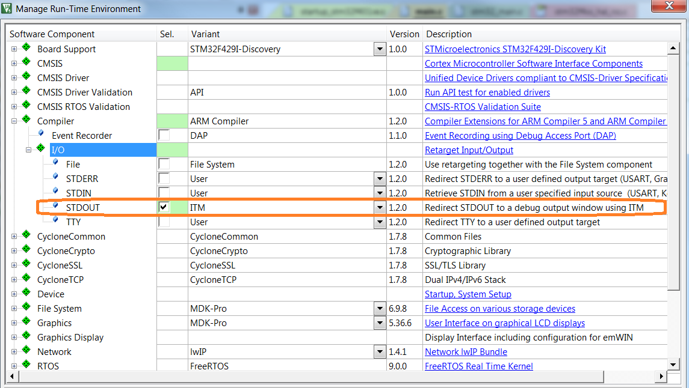

# Setting UP Input and Output on Nucleo-STM32 & uVision #

Introduction
============

There are fundamental differences when you develop software for STM32
based embedded systems and when you develop software for UNIX, LINUX or
any Windows PC. The “The C Programming Language” book of K&R uses UNIX
as reference system. So we have to adapt the description written in “The
C Programming Language” to our STM32 based development environment.

The big fundamental difference is how Input and Output are handled.
Input and output are not part of the C language itself, but platform
environment dependent.

The structure of standard I/O library functions, such
as printf(), scanf(), or fgetc() to perform input/output operations is
platform environment dependent. The platform environment dependent
includes the Nucleo-STM32 board and also the Keil uVision IDE running on
a Windows based Host System.

We will not explain here the implementation details of I/O Retargeting,
but we have highlighted the topic here to bring the user attention to
the topic. Because of this different implantation the visualization of
output and sending keyboard inputs are different in this Nucleo based
development Environment than the UNIX Environment described in The “The
C Programming Language” book of K&R.

Step the Project Code for “I/O Retargeting” on Nucleo-STM32
===========================================================

This section describes how to setup uVision tool and your project to add
support for “Retarget Output via ITM”. For details about ITM refer to
ARM website.

Setup the uVision Run-Time Environment
--------------------------------------

To change the retarget option for **STDOUT** to **ITM**, click on:

**Project =\>** **Manage** =\> **Run-Time** **Environment** which will
open Manage Run-Time Environment Window.

In Manage Run-Time Environment Window as below click **Compiler =\> I/O
=\> STDOUT**

window and change the default value “User” to “ITM”.

Then Click the Box to enable as shown below

Then Select OK as below.

Project File structure before ITM is enabled:

Project File structure after ITM is enabled:

So enabling ITM will add retarget\_io.c file by uVision tool.

This C file contains all the code to transfer printf data.

**Enabling ITM also sets one important Header file RTE\_Components.h**

Setup the Project Options
-------------------------

Go to Project =\> Options for Target =\> Debug =\> Settings =\> Trace

### Step 1

Set Core Clock value to **SYSCLK** of your running program.

**This should be same as the SYSCLK. If this value is not same as SYSCLK
value the printf output will NOT Come.**

For example if you don’t call SystemClock\_Config() function, then
SYSCLK Value is same as System Clock source.

For Nucleo-F401RE, System Clock source is HIS, whose value is 16Mhz. So
the Core Clock value

Should be 16.

If you have a custom board and you use HSE which are normally 4MHz, the
Core Clock value

Should be 4.

If you call SystemClock\_Config() function then normally Core Clock
value is 84MHz. so the Core Clock value should be 84MHz.

Remember that it should be same as Core Clock value, otherwise it would
not work. For 84Mhz I tried to set 80Mhz and it didn’t work.

### Step 2

Enable “Trace Enable” as shown is picture below.

### Step 3

Enable “Autodetect” as shown is picture below.

### Step 4

Write 0x00000001 to ITM Stimulus Ports: Enable

Write 0x00000001 to ITM Stimulus Ports: Privilege

Code will still work if we don’t enable **Privilege**.

Click OK.

Build and run the code.

Voila…. Your print output is available in “Debug (printf) Viewer”.

Run the code
------------

Run the project. The code will stop at break point.

Go to View =\> Serial Windows =\> Debug (printf) Viewer and click open
the window.

You can see the printf output on Debug (printf) viewer.

Important Points to Remember
----------------------------

We are using ST-Link as debugger.

And we are not using any initialization INI file to enable ITM trace.

