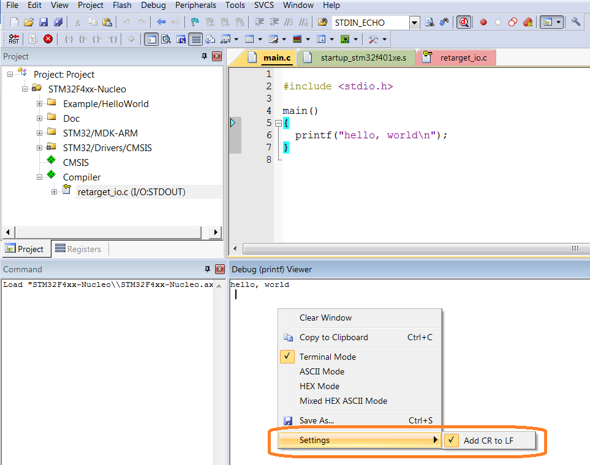

# Newline #

Introduction
============

The C library implements a simple model of text input and output. A text
stream consists of a sequence of lines; each line ends with a newline
character. If the system doesn't operate that way, the library does
whatever necessary to make it appear as if it does.

For instance, the library might convert carriage return and linefeed to
newline on input and

back again on output.

The newline character (\\n) is equivalent to the ASCII linefeed
character (hex 0A). Thus, for files opened in text mode, CR/LF pairs are
read in as newline characters, and newline characters are written as
CR/LF.  
  
  
This information applies to STDIN, STDOUT, and STDERR, which are opened
in text mode by default.   
  
In most C compilers, including uVision, the newline escape sequence
'\\n' yields an ASCII line feed character. The C escape sequence for a
carriage return is '\\r'.

When we create C programs in what the C Standard calls a "hosted
implementation" (where the programs run under an operating system), the
operating system or the stdio library routines are supposed to convert
the newline character to whatever it takes to actually go to the
beginning of the next line, e.g., carriage return + line feed.

For a "freestanding implementation" (where the programs run without any
operating system), the Standard doesn't specify any requirements for
library routines. It is up to the compiler vendor to decide what library
routines to provide, and how each should work. All Keil compilers are
freestanding implementations of C.

Users of the compilers send the output from printf() to a variety of
devices with different requirements for marking the end of a line. So,
any method complier might choose to handle '\\n' would be wrong in many
cases.

On output, the default version of ARM library routine putchar() handles
newline characters by outputting a carriage return and a line feed.

Many projects require a user-written version of putchar(). If your
project has a custom putchar() function, it may handle newline
characters differently.

RESOLUTION
----------

There are three different ways to solve this problem:

1.  Include a '\\r' along with (or perhaps instead of) the '\\n' in
    > output strings. For example:

> printf("Hello world\\r\\n");

1.  Modify the putchar() function such that when it is called to output
    > a line feed, it outputs a carriage return in addition to the line
    > feed.

2.  Use a terminal that will treat a line feed character as a newline
    > character (i.e., as a carriage return and line feed).

Retarget Output via ITM
-----------------------

The code we have written uses “Retarget Output via ITM” to output and
take input. In this implementation we use option (ii) and (iii). So our
code in ‘retarget\_io.c’ file modifies the putchar() function such that
when it is called to output a line feed, it outputs a carriage return in
addition to the line feed.

Also in the terminal we use “Debug (printf) Viewer”, we set “Settings”
that will treat a line feed character as a newline character (i.e., as a
carriage return and line feed) by selecting “Add CR to LF”.

