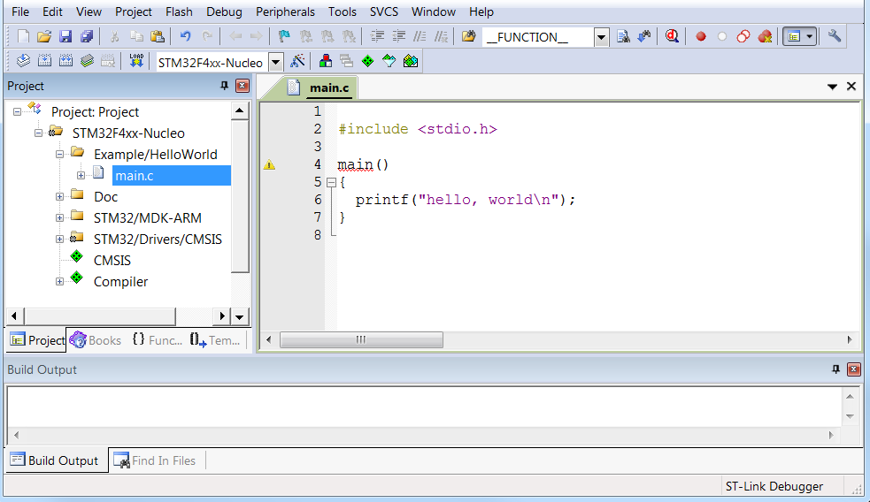
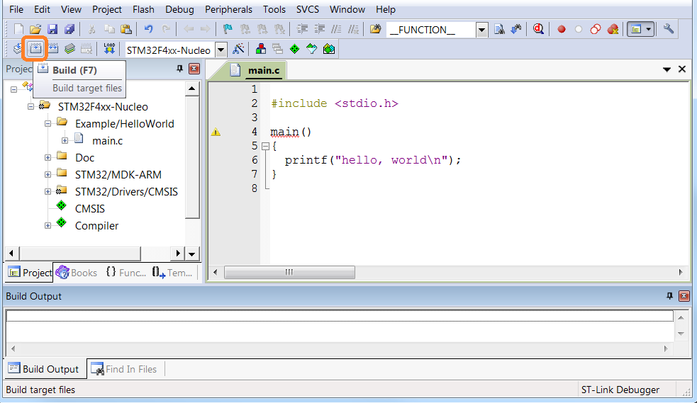
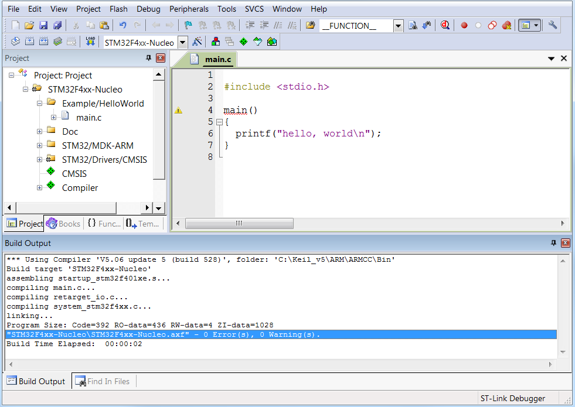
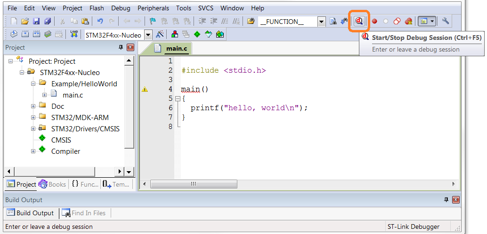
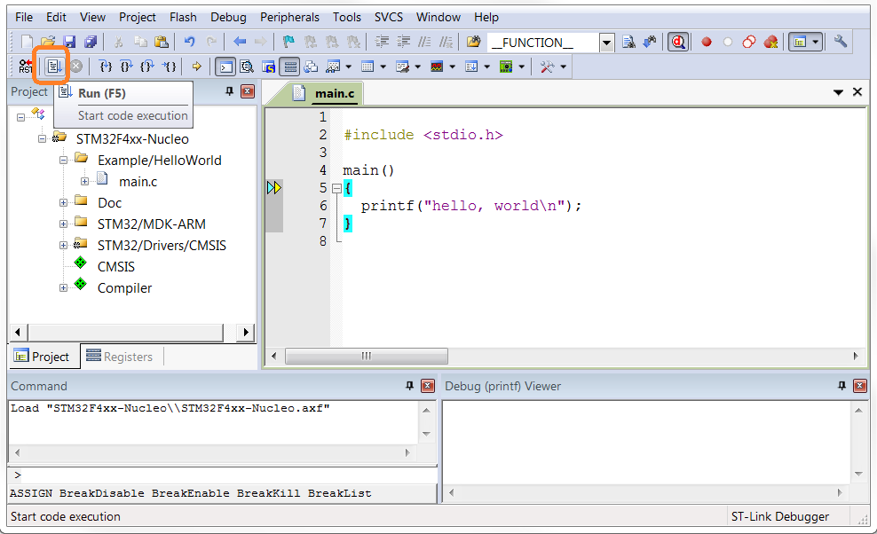
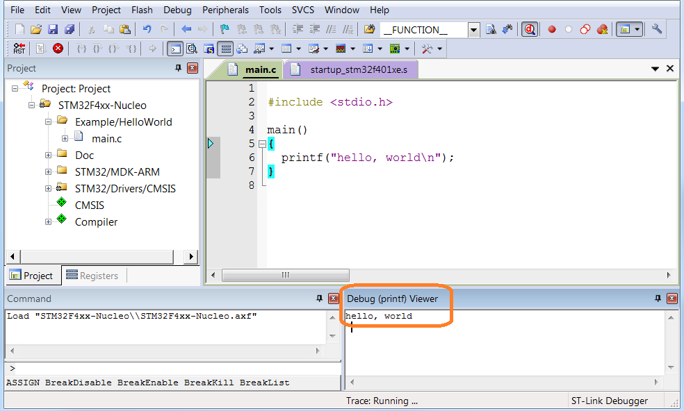

# KernighanRitchie and STM32 #
Running C programs written in the book "The C Programming Language" on STM32.

Introduction
============

This blog is here to help the reader learn:

-   How to program in C in general as described in the book "The C
    Programming Language".

-   How to program for embedded systems in particular

-   How to program in STM32 in specificity

\[Copy from Preface to the first edition – C book\]

Kernighan and Ritchie
---------------------

Dennis MacAlistair Ritchie invented the C Programming language and
together with Ken Thompson co-created the UNIX operating system at Bell
Labs. Ritchie co-authored the book “The C Programming Language” together
with Brian Kernighan and is the “R” in “K&R”.

The book "The C Programming Language" is central to the development and
popularization of the C programming language and is still widely read
and used today. Because the book was co-authored by the original
language designer, the book is considered as the primary initiator of
the learning the language. The book is still regarded by many as the
principal learning reference of C language.

C is until today the language of choice for systems programmers who want
to get the fastest performance from operating systems, compilers and
other programs. It’s a small, clean and simple language which lets you
get close to the machine, without getting tied up in the machine.

STM32
-----

The STM32 is a family of microcontroller ICs based on the 32-bit RISC
ARM Cortex-M7F, Cortex-M4F, Cortex-M3, Cortex-M0+, and Cortex-M0 cores.
These Microcontrollers are produced by Microcontroller giant
STMicroelectronics ([www.st.com](http://www.st.com)).

It offers products combining very high performance, real-time
capabilities, digital signal processing, and low-power and low-voltage
operation, and connectivity, while maintaining full integration and ease
of development.

The unparalleled and large range of STM32 devices, based on an
industry-standard core and accompanied by a vast choice of tools and
software, makes this family of products the ideal choice, both for small
projects or an entire platforms.

Today STM32 is most popular Microcontroller for Embedded Design Domain
including the new popular IoT designs.

Refer to
<http://www.st.com/en/microcontrollers/stm32-32-bit-arm-cortex-mcus.html>
for details on STM32.

Software Tools
--------------

To write the software we will need an Integrated Development Environment
(IDE) for Embedded Systems. Today the software are written using Keil
µVision. The Keil development tools offer numerous features that help
you to develop embedded applications quickly and successfully. It
includes the components you need to create, build, download, debug and
Test all your STM32 projects.

You can also use other IDEs like TrueSTUDIO for STM32, IAR Embedded
Workbench or any other IDEs.

Hardware Tools
--------------

As Hardware you need STM32 Nucleo boards. The STM32 Nucleo boards allow
to try out new ideas and to quickly create prototypes with any STM32
MCU. The best part of STM32 Nucleo boards is that they integrate an
ST-Link debugger/programmer, so there is no need for a separate probe.

For all the codes here we use STM32 Nucleo-64 development board with
STM32F401RE MCU.

System Setup
------------

Before starting the user should:

1.  Install an Integrated Development Environment (IDE) for Embedded
    Systems.

> Refer to Getting Started Section for details.

1.  Install ST-LINK/V2-1 USB driver

> All the STM32 Nucleo boards include an ST-LINK/V2-1 embedded debug
> tool interface. This interface needs a dedicated USB driver to be
> installed. This driver is available at the www.st.com website and
> supported within the Keil Microcontroller Development Kit (MDK-ARM)
> toolchain. When the Nucleo board is connected, the PC detects new
> connecting hardware and requires to install the ST-LINK\_V2\_USB
> driver. The “Found New Hardware wizard” appears and guides the user
> through the steps needed to install the driver from the recommended
> location.

Download the project and build the code
---------------------------------------

Download the project from this GitHub location. Open and build it using
µVision. Establish the connection with the STM32 Nucleo board, by
connecting CN1 of the Nucleo board to the USB port of the PC (Figure
show the connector CN1 inside the red circle).

Getting Started
===============

According to K&R, the only way to learn a new programming language is by
writing programs in it. They say the first program to write is the same
for all languages and we also follow the same:

> *Print the words*
>
> hello, world

As rightly said by K&R, writing this small program is a big hurdle.

To leap over it you have to be able:

-   to create the program text somewhere,

-   compile it successfully,

-   load it,

-   run it, and

-   find out where your output went.

With these mechanical details mastered, everything else is comparatively
easy.

So first we will describe how to leap over these mechanical details. To
leap over these steps we use an Integrated Development Environment (IDE)
for Embedded Systems. These IDEs allow you complete all the steps in one
Tool environment.

You can use any IDE for Embedded Systems. Ex.

-   TrueSTUDIO for STM32, <https://atollic.com/>

-   µVision IDE, http://www2.keil.com/mdk5/µVision/

-   IAR Embedded Workbench,
    <https://www.iar.com/iar-embedded-workbench/>

-   Or any other ARM tools

We used µVision IDE, from
[http://www2.keil.com/mdk5/µVision/](http://www2.keil.com/mdk5/uvision/),
without any specific reason.

There are fundamental differences when you develop software for STM32
based embedded systems and when you develop software for UNIX, LINUX or
any Windows PC. The “The C Programming Language” book of K&R uses UNIX
as reference system. So we have to adapt the description written in “The
C Programming Language” to our STM32 based development environment.

As mentioned will use µVision IDE, refer to “Keil µVision Getting
Started Guide” @ <http://www.keil.com/arm/uv-gettingstarted.asp> to how
to use the Keil development tools. Or refer to section “µVision Concise
Steps,” for concise version of how to use the tool for the examples
given here.

In C, the program to print \`\`hello, world'' is

> \#include \<stdio.h\>
>
> main()
>
> {
>
> printf("hello, world\\n");
>
> }

To run this program on STM32, you must create the program in a file
whose name ends in \`\`.c'',

such as main.c,

**Then build (compile & link) it by clicking the “Build” button**,
marked in Red Rectangle.

**If you haven't botched anything**, such as omitting a character or
misspelling something, the

compilation will proceed silently, and make an **executable file called
STM32F4xx-Nucleo.axf**.

Load the executable STM32F4xx-Nucleo.axf to Nucleo-STm32F401RE board by
clicking “Start/Stop Debug Session”, marked in Red Rectangle.

The executable will get loaded to the Nucleo board and the program will
run to main() function and wait there.

Run STM32F4xx-Nucleo.axf by clicking “Run” button, marked in Red
Rectangle.

When the program runs, it will print the output to ‘Debug (printf)
Viewer’ in the uVision IDE.

hello, world

We can review the steps written at the beginning:

To leap over it you have to be able:

-   create the program text, using the uVision IDE.

-   compile it successfully, by clicking ‘build’ button.

-   load it, by clicking ‘Start/Stop Debug Session’ button

-   run it, and by clicking ‘run’ button.

-   find your output in ‘Debug (printf) Viewer’ in the uVision IDE.

µVision Concise Steps
=====================

Note: When we refer to PC here, we mean Windows PC.

1.  Install Keil using the web download

    1.  Download the product from www.keil.com/demo

    2.  Run the downloaded executable

    3.  Follow the instructions displayed by the SETUP program

2.  Download Example programs from Github to your PC.

3.  Open the project in your PC in Keil

    1.  Go to folder
        KernighanRitchieandSTm32\\Example\\KR\\Chapter1\\Section1.1\\HelloWorld\\MDK-ARM.

    2.  Click the file Project.uvprojx.

4.  Build the project

5.  Load and Run the project

6.  See the output
